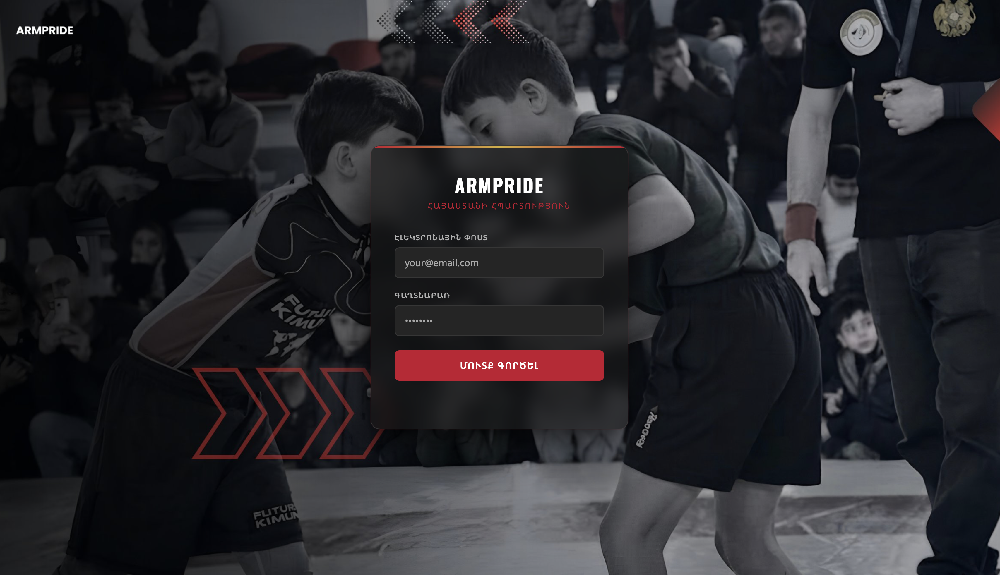

# ARMPRIDE — Sports Academy Management System

A full-stack web application for managing a sports academy's operations — director, coach, and athlete profiles, competition tracking, and document management — built from scratch.

 <!-- replace with an actual screenshot -->

## 🔗 Live Demo
[[link here]](https://arm-pride.vercel.app/index.html) <!-- add if deployed -->

## ✨ Features

- **Role-based profiles** — separate CRUD-managed profiles for Directors, Coaches, and Athletes
- **Authentication & authorization** — secure login flow with role-based access control
- **File storage** — photo and document uploads (certifications, records) via Supabase Storage
- **Competition management** — track competitions, results, and participant history
- **Director dashboard** — dedicated section for academy administration with full CRUD support

## 🛠️ Tech Stack

- **Frontend:** JavaScript, HTML, CSS (vanilla — no framework)
- **Backend / Database:** [Supabase](https://supabase.com/) (PostgreSQL, Auth, Storage)

## 🚀 Getting Started

```bash
git clone https://github.com/AnahitDarbinyan/ArmPride/
cd ArmPride
```

## 📌 Why I Built This

Built to solve a real operational need for a sports academy — moving athlete/coach records, document tracking, and competition history off spreadsheets and into a proper managed system. Built solo, from schema design through UI.
